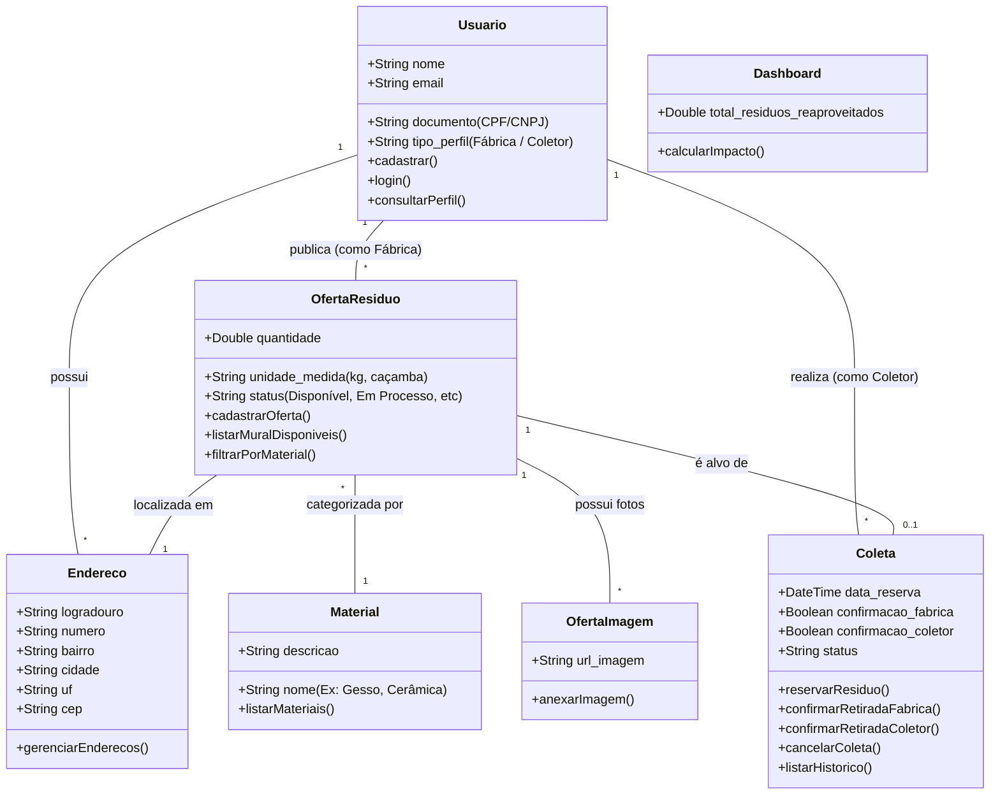

# Diagrama de Classes - Modelo Conceitual

Este diagrama apresenta as classes de conceito e as principais funcionalidades do sistema, baseadas nos requisitos funcionais e nas rotas das APIs desenvolvidas. O objetivo é focar na abstração e nas regras de negócio, sem se aprofundar em detalhes de infraestrutura ou do framework.

## Funcionalidades e Requisitos Atendidos

- **Cadastro de Usuários e Perfis (RF01) / Login (RF02)**: Mapeados na classe `Usuario`.
- **Cadastro de Oferta (RF03) e Imagens**: Mapeados nas classes `OfertaResiduo` e `OfertaImagem`.
- **Mural de Resíduos (RF04) e Filtros (RF09)**: Funcionalidades base na classe `OfertaResiduo` associada a `Material`.
- **Reserva de Coleta (RF05) e Confirmações (RF06)**: Fluxo de negócio gerenciado pela classe `Coleta` que interliga os perfis.
- **Histórico (RF07)**: Funcionalidade de listar operações realizadas abstraída em `Coleta`.
- **Gerenciamento de Endereços (RF08)**: Representado pela classe `Endereco`.
- **Dashboard de Impacto (RF10)**: Abstraído na classe de conceito `Dashboard`.
