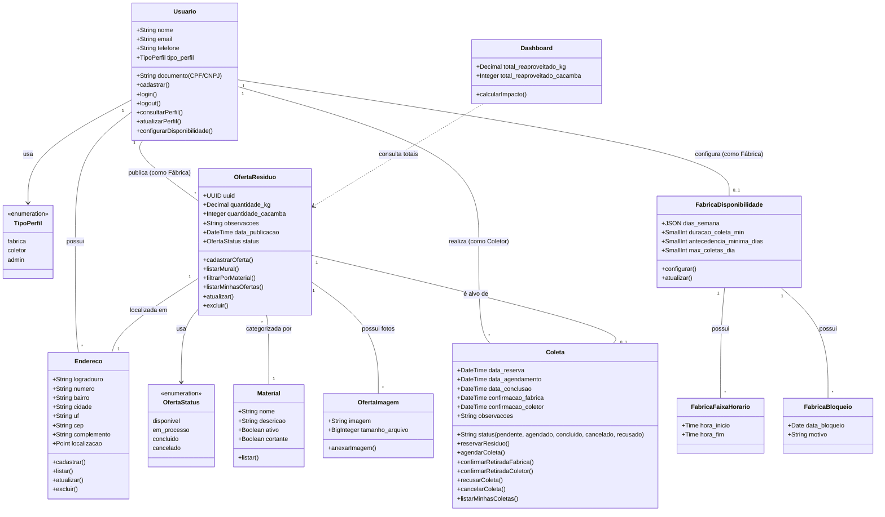

# Diagrama de Classes – Modelo Conceitual

Este diagrama apresenta as classes de conceito e as principais funcionalidades do sistema **EcoCeramica**, baseadas nos requisitos funcionais documentados e nas APIs desenvolvidas no backend Laravel. O foco é na abstração do domínio e nas regras de negócio, sem detalhar classes de infraestrutura do framework.

## Mapeamento de Requisitos Funcionais

| Requisito | Classe(s) Envolvida(s) | Observações |
|-----------|------------------------|-------------|
| **RF01** – Cadastro de Usuários e Perfis | `Usuario`, `TipoPerfil` | Cadastro com validação de CPF/CNPJ e perfil (Fábrica, Coletor ou Admin) |
| **RF02** – Login e Autenticação | `Usuario` | Autenticação via Sanctum (token); isolamento de dados por usuário |
| **RF03** – Cadastro de Oferta de Resíduo | `OfertaResiduo`, `Material` | Registro de material com quantidade em kg e/ou caçambas, com possibilidade de observações |
| **RF04** – Mural de Resíduos Disponíveis | `OfertaResiduo`, `Endereco` | Listagem pública filtrada por status "disponível" |
| **RF05** – Reserva/Agendamento de Coleta | `Coleta`, `OfertaResiduo`, `FabricaDisponibilidade` | Muda status de "disponível" para "em processo" ao reservar/agendar. Respeita disponibilidade configurada |
| **RF06** – Confirmação e Conclusão de Retirada | `Coleta` | Dupla confirmação (fábrica + coletor) via DateTime; conclui ao ter ambas. Fábrica pode recusar |
| **RF07** – Histórico de Descarte/Coleta | `Coleta`, `OfertaResiduo` | Endpoints "minhas-coletas" e "minhas-ofertas" |
| **RF08** – Gerenciamento de Endereços | `Endereco` | CRUD completo com campo de geolocalização (Point) e complemento |
| **RF09** – Filtro por Tipo de Material | `OfertaResiduo`, `Material` | Filtragem do mural por `material_id` |
| **RF10** – Dashboard de Impacto | `Dashboard` | Soma de `quantidade_kg` e `quantidade_cacamba` das ofertas concluídas |
| **RF11** – Configuração de Disponibilidade | `FabricaDisponibilidade`, `FabricaFaixaHorario`, `FabricaBloqueio` | Fábrica define dias da semana, faixas de horário e datas de bloqueio para permitir coletas |
