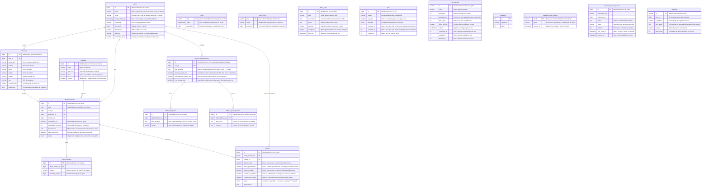

# Modelagem Entidade Relacionamento (MER)

Baseado no script físico de banco de dados `ecoceramica-pf-banco-fisico-20260601.sql`.

```mermaid
erDiagram
    %% Tabelas do Domínio da Aplicação
    users {
        bigint id PK "Identificador único do usuário"
        varchar nome "Nome completo do usuário ou razão social da fábrica"
        varchar email "Endereço de e-mail do usuário para login e contato"
        timestamp email_verified_at "Data e hora em que o e-mail foi verificado"
        varchar password "Senha criptografada do usuário"
        enum tipo_perfil "'fabrica', 'coletor', 'admin'"
        varchar documento "CPF ou CNPJ do usuário"
        varchar telefone "Número de telefone ou celular para contato"
        varchar remember_token "Token para manter a sessão do usuário ativa"
    }

    enderecos {
        bigint id PK "Identificador único do endereço"
        bigint user_id FK 
        varchar logradouro "Nome da rua, avenida, etc."
        varchar numero "Número do imóvel"
        varchar bairro "Nome do bairro"
        varchar cidade "Nome da cidade"
        varchar estado "Sigla do estado (UF)"
        varchar cep "CEP do endereço"
        varchar complemento "Complemento do endereço"
        point localizacao "Coordenadas geográficas do endereço"
    }

    materiais {
        bigint id PK "Identificador único do tipo de material"
        varchar nome "Nome do material"
        varchar descricao "Descrição detalhada do material"
        boolean ativo "Indica se o material está ativo para uso"
        boolean cortante "Sinaliza se o material oferece risco de corte"
    }

    ofertas_residuos {
        bigint id PK "Identificador único da oferta"
        char uuid "Identificador universal único da oferta"
        bigint user_id FK 
        bigint endereco_id FK 
        bigint material_id FK 
        decimal quantidade_kg "Quantidade ofertada em quilos"
        int quantidade_cacamba "Quantidade ofertada em caçambas"
        text observacoes "Observações adicionais sobre o resíduo e a coleta"
        datetime data_publicacao "Data de publicação da oferta no sistema"
        enum status "'disponivel', 'em processo', 'concluido', 'cancelado'"
    }

    oferta_imagens {
        bigint id PK "Identificador único da imagem"
        bigint oferta_residuo_id FK 
        varchar imagem "URL ou caminho do arquivo de imagem"
        bigint tamanho_arquivo "Tamanho da imagem em bytes"
    }

    fabrica_disponibilidades {
        bigint id PK "Identificador único da configuração de disponibilidade"
        bigint user_id FK 
        json dias_semana "Dias da semana disponíveis [0=dom, 1=seg, ..., 6=sab]"
        smallint duracao_coleta_min "Duração da coleta em minutos (30, 60, 120). NULL = dia inteiro"
        smallint antecedencia_minima_dias "Dias mínimos de antecedência (0 = mesmo dia)"
        smallint max_coletas_dia "Quantidade máxima de coletas que a fábrica aceita por dia"
    }

    fabrica_bloqueios {
        bigint id PK "Identificador único do bloqueio"
        bigint disponibilidade_id FK 
        date data_bloqueio "Data específica bloqueada (ex: feriado, férias)"
        varchar motivo "Motivo do bloqueio (ex: Feriado de Natal)"
    }

    fabrica_faixas_horarios {
        bigint id PK "Identificador único da faixa de horário"
        bigint disponibilidade_id FK 
        time hora_inicio "Horário de início da faixa (ex: 08:00)"
        time hora_fim "Horário de fim da faixa (ex: 12:00)"
    }

    coletas {
        bigint id PK "Identificador único da coleta"
        bigint oferta_residuo_id FK 
        bigint coletor_id FK 
        datetime data_reserva "Data e hora em que a reserva da coleta foi feita"
        datetime data_agendamento "Data e horário agendado pelo coletor para realizar a coleta"
        datetime data_conclusao "Data e hora em que a coleta foi finalizada fisicamente"
        datetime confirmacao_fabrica "Data de confirmação de entrega do resíduo pela fábrica"
        datetime confirmacao_coletor "Data de confirmação do recolhimento pelo coletor"
        enum status "'pendente', 'agendado', 'concluido', 'cancelado', 'recusado'"
        text observacoes 
    }

    %% Relacionamentos do Domínio
    users ||--o{ enderecos : "possui"
    users ||--o{ ofertas_residuos : "cria"
    users ||--o{ fabrica_disponibilidades : "configura"
    users ||--o{ coletas : "realiza (como coletor)"

    enderecos ||--o{ ofertas_residuos : "localiza"

    materiais ||--o{ ofertas_residuos : "classifica"

    ofertas_residuos ||--o{ oferta_imagens : "possui"
    ofertas_residuos ||--o{ coletas : "é alvo de"

    fabrica_disponibilidades ||--o{ fabrica_bloqueios : "possui"
    fabrica_disponibilidades ||--o{ fabrica_faixas_horarios : "possui"


    %% Tabelas de Sistema / Framework (Laravel)
    cache {
        varchar key PK "Chave de identificação do registro no cache"
        mediumtext value "Valor serializado armazenado em cache"
        bigint expiration "Timestamp indicando a validade do cache"
    }
    
    cache_locks {
        varchar key PK "Chave de identificação do bloqueio"
        varchar owner "Identificador do proprietário do bloqueio"
        bigint expiration "Timestamp indicando a validade do bloqueio"
    }
    
    failed_jobs {
        bigint id PK "Identificador único da falha"
        varchar uuid "UUID referenciando a falha"
        text connection "Conexão utilizada no momento da falha"
        text queue "Fila na qual ocorreu a falha"
        longtext payload "Dados do job que ocasionou a falha"
        longtext exception "Mensagem/stacktrace da exceção lançada"
        timestamp failed_at "Momento exato da falha do job"
    }
    
    jobs {
        bigint id PK "Identificador único do job"
        varchar queue "Nome da fila que processará o job"
        longtext payload "Dados necessários para execução do job"
        tinyint attempts "Contador de tentativas de execução"
        int reserved_at "Data e hora que o job foi reservado para processamento"
        int available_at "Data e hora que o job estará pronto para processamento"
        int created_at "Data e hora de criação do job"
    }
    
    job_batches {
        varchar id PK "Identificador único do lote de jobs"
        varchar name "Nome atribuído ao lote"
        int total_jobs "Número total de jobs no lote"
        int pending_jobs "Número de jobs aguardando processamento"
        int failed_jobs "Número de jobs que falharam"
        longtext failed_job_ids "IDs dos jobs que falharam no lote"
        mediumtext options "Opções de configuração do lote"
        int cancelled_at "Data e hora do cancelamento do lote"
        int created_at "Data e hora de criação do lote"
        int finished_at "Data e hora de conclusão do lote"
    }
    
    migrations {
        int id PK 
        varchar migration 
        int batch 
    }
    
    password_reset_tokens {
        varchar email PK "E-mail do usuário solicitando a redefinição"
        varchar token "Token único gerado para a redefinição de senha"
        timestamp created_at "Data e hora em que o token foi criado"
    }
    
    personal_access_tokens {
        bigint id PK "Identificador único do token"
        varchar tokenable_type 
        bigint tokenable_id 
        text name "Nome de identificação do token"
        varchar token "Hash do token de acesso pessoal"
        text abilities "Permissões concedidas ao token"
        timestamp last_used_at "Última vez que o token foi utilizado"
        timestamp expires_at "Data limite de validade do token"
    }
    
    sessions {
        varchar id PK "Identificador único da sessão"
        bigint user_id "ID do usuário associado à sessão"
        varchar ip_address "Endereço IP de origem da sessão"
        text user_agent "Informações do navegador/dispositivo (User-Agent)"
        longtext payload "Dados da sessão serializados"
        int last_activity "Timestamp da última atividade na sessão"
    }
```
